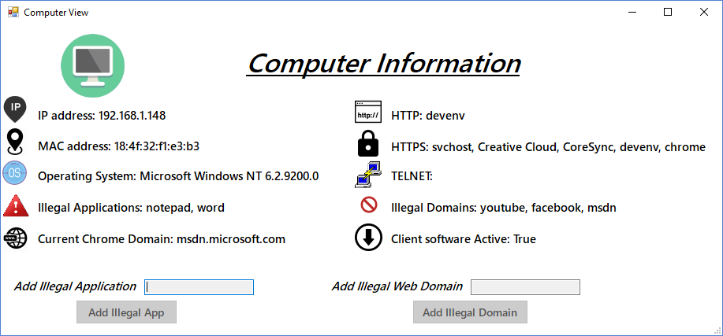
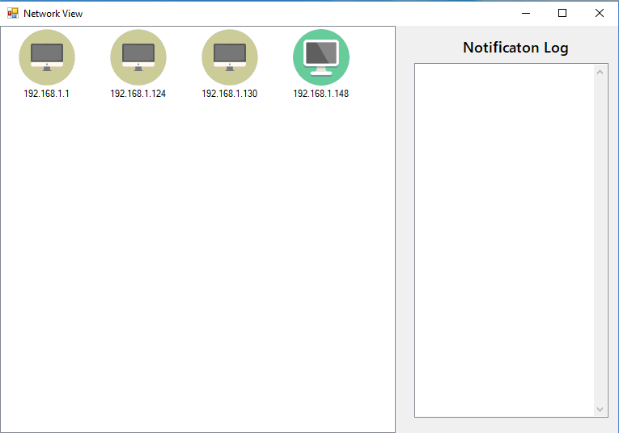
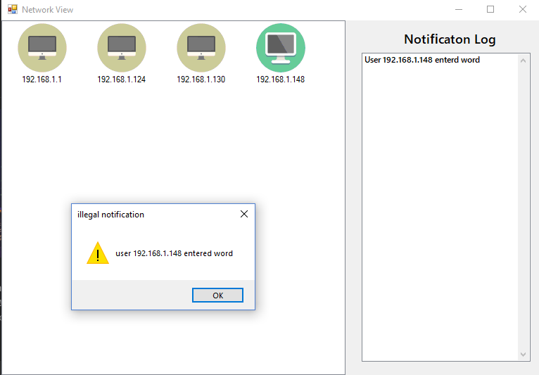
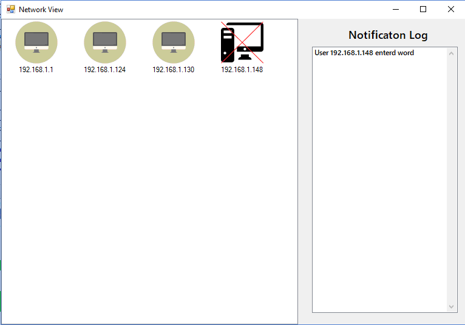

# 🖥️ Network Analyzer – Local Network Monitoring System

> A user-friendly network monitoring system that detects illegal activity, identifies operating systems, and visualizes LAN computers in real time.



---

## 📌 Overview

**Network Analyzer** is a full-stack system for monitoring a local area network (LAN). It provides real-time insights into connected devices, alerts on suspicious behavior, and allows admins to set "illegal" applications or web domains to track.

> 🔐 This project was developed as my final high school project for the Israeli **Bagrut exam** in **Computer Science (10 units)** at **Amos De-Shalit High School**, Rehovot.

---

## 📁 Features

<details>
  <summary>🌐 Network Discovery</summary>

- Shows all computers connected to the LAN
- Color-coded client presence and status
- Real-time graphical updates
</details>

<details>
  <summary>🖥️ Computer Monitoring</summary>

- IP & MAC address display
- Detected OS via fingerprinting
- List of open HTTP, HTTPS, Telnet connections
- Current Chrome domain
- Detection of predefined illegal apps/domains
</details>

<details>
  <summary>🚨 Alert System</summary>

- Pop-up alerts for illegal activity
- Notification log
- Automatically flags and disables offending devices
</details>

<details>
  <summary>🔍 OS Fingerprinting</summary>

- Uses ICMP and ARP packets via Scapy
- Distinguishes OS based on protocol behavior
</details>

---

## 🛠️ Tech Stack

| Component | Tech |
|----------|------|
| Backend  | Python 2.6/2.7, Scapy |
| Client   | C# (.NET Framework, WinForms) |
| Admin GUI | C# (.NET Framework, WinForms) |
| Debugging Tools | Wireshark |

---

## 🖼️ Screenshots

| Network View | Client Info | Alert Pop-up | Disabled Host |
|--------------|-------------|--------------|---------------|
|  |  |  |  |

---

## 🚀 Installation

### 🔧 Requirements

| Module | OS | Requirements |
|--------|----|--------------|
| Server | Windows 7/8/10 | Python 2.6/2.7 + Scapy |
| Client | Windows 10+ | .NET Framework |
| Admin  | Windows 10+ | .NET Framework |

### ⚙️ Setup

1. Clone this repo:
   ```bash
   git clone https://github.com/yourusername/NetworkAnalyzer.git
